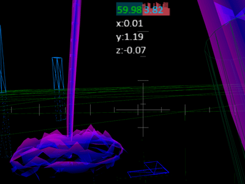

# TeleportVR

Teleport module for WebVR and THREE.js projects.

You can download the project and view the examples.

```bash
git clone https://github.com/Sean-Bradley/TeleportVR.git
cd TeleportVR
npm install
npm run dev
```

Visit https://127.0.0.1:3000/

## How to import TeleportVR

```bash
npm install teleportvr
```

Import it into your code

```javascript
import TeleportVR from "teleportvr";
```

## How to Instantiate And Use

After creating your `THREE.Scene` and `THREE.Camera`, create a new **TeleportVR** object.

```javascript
const teleportVR = new TeleportVR(scene, camera);
```

Create geometries for the hands and add controller grips, see example code for more info.

Update **TeleportVR** in your render loop

```javascript
teleportVR.update();
renderer.render(scene, camera);
```

## Example 1

Basic TeleportVR setup for WebVR and Threejs projects.

[](https://sbcode.net/threejs/teleportvr-1/)

## Example 2

Shoot at objects in the scene.

[](https://sbcode.net/threejs/teleportvr-2/)

## Example 3

Teleport on top of objects in the scene.

[](https://sbcode.net/threejs/teleportvr-3/)

## Example 4

Customising the TeleportVR default meshes.

[](https://sbcode.net/threejs/teleportvr-4/)

## TeleportVR Source Project

This is a typescript project consisting of two sub projects with there own _tsconfigs_.

To edit this example, then modify the files in `./src/client/` or `./src/server/`

The projects will auto recompile if you started it by using _npm run dev_

## Threejs TypeScript Course

Visit https://github.com/Sean-Bradley/Three.js-TypeScript-Boilerplate for a Threejs TypeScript boilerplate containing many extra branches that demonstrate many examples of Threejs.

> To help support this Threejs example, please take a moment to look at my official Threejs TypeScript course at

[](https://www.udemy.com/course/threejs-tutorials/?referralCode=4C7E1DE91C3E42F69D0F)

[Three.js and TypeScript](https://www.udemy.com/course/threejs-tutorials/?referralCode=4C7E1DE91C3E42F69D0F)<br/>  
 Discount Coupons for all my courses can be found at [https://sbcode.net/coupons](https://sbcode.net/coupons)
